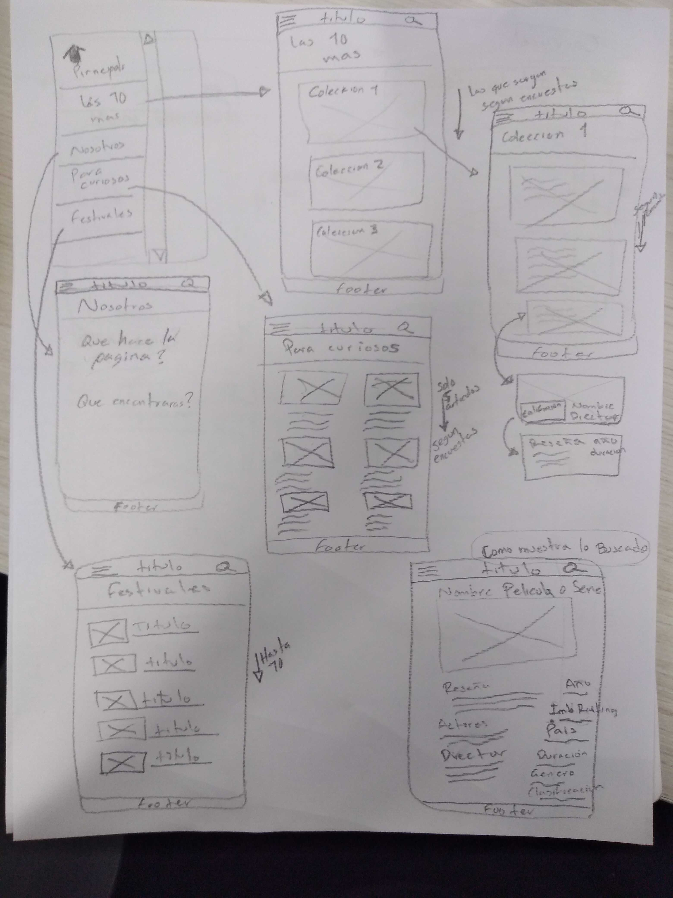
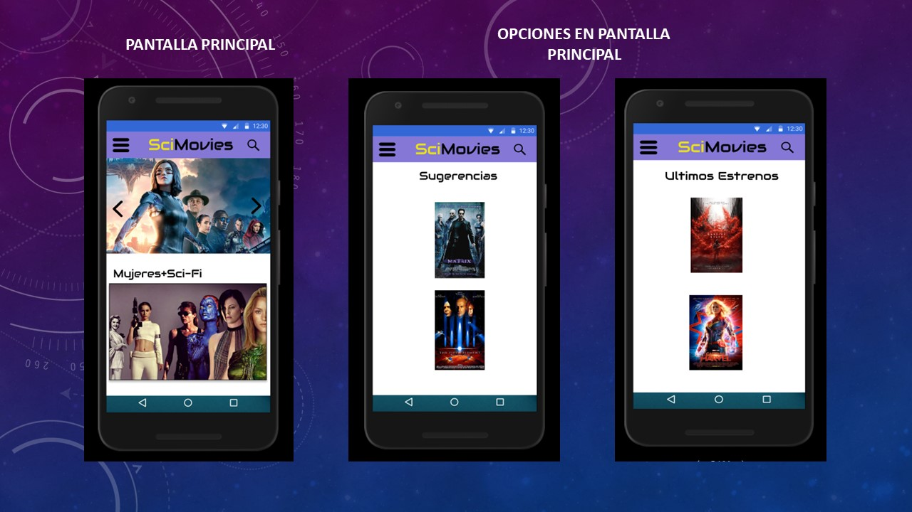
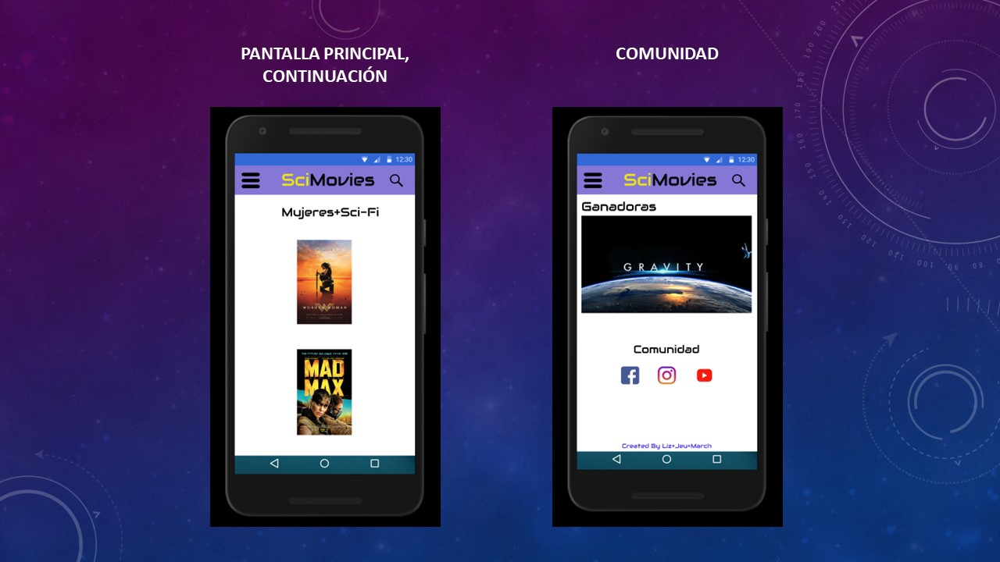
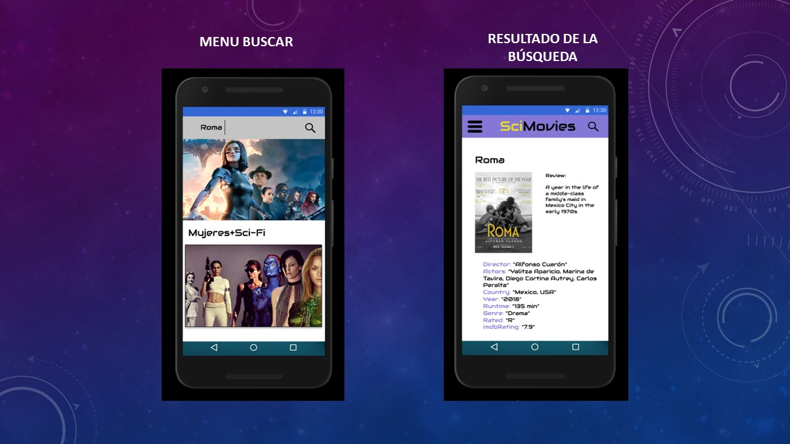
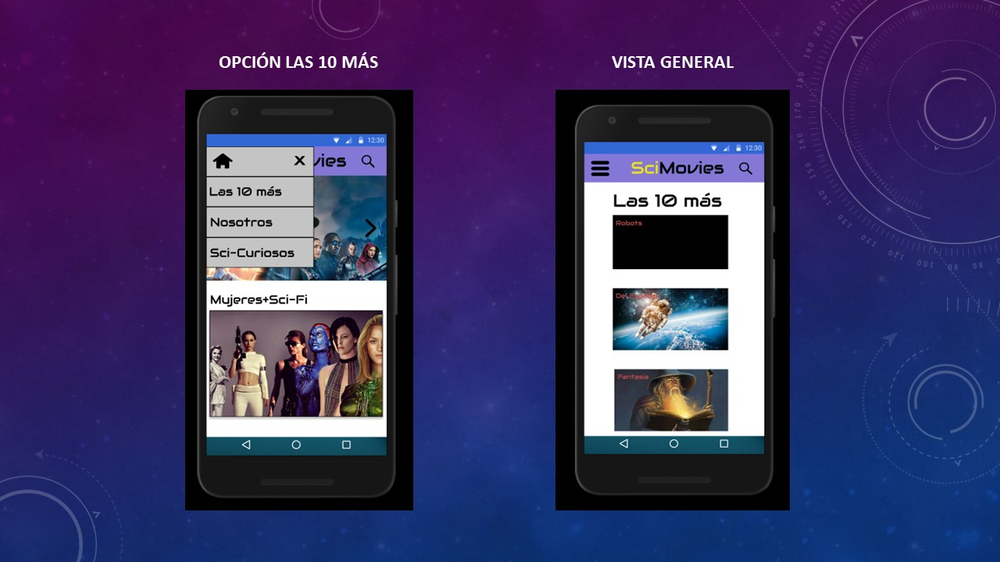
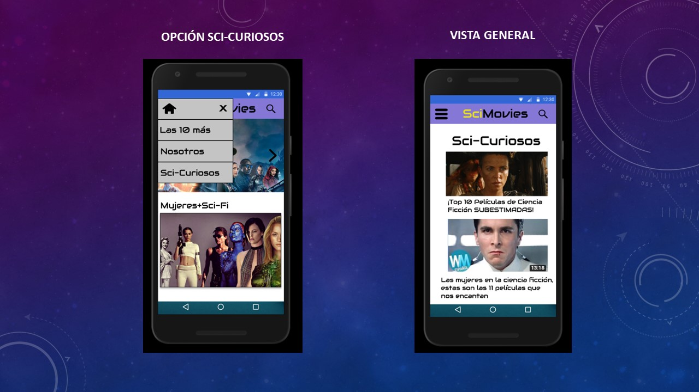
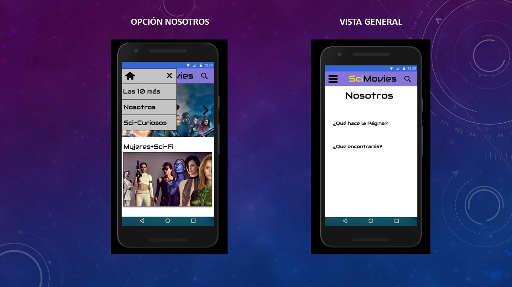

# "Hackathon" de final de Common Core, películas

# GDL002 - SciMovies

[Link a GitHub Pages ](https://jeu-manzo.github.io/GDL002-hackathon-interna/src/html/index.html)

## Índice Proyecto

- [Generales](#Consideraciones-Generales)
- [Planning](#Desarrollo-del-Proyecto)
- [Sketches Bajo Nivel](#Prototipo-de-Bajo-Nivel)
- [Sketches Alto Nivel](#Prototipo-de-Alto-Nivel)
- [Agenda de trabajo](#Distribución-del-trabajo)
- [Research](#Recursos)
- [Check List](#Check-List-Done)

## Consideraciones generales

-Durante estos días se asignó la actividad de crear un producto acerca del mundo de las películas. Se dió la opción de elegir trabajar en un sitio que hable de las mejores películas latinoamericanas, uno que recomiende las películas recién estrenadas en algún servicio de streaming, uno de recomendaciones de películas de terror, comedia o cualquier opción a elección del grupo de  trabajo, con las siguientes consideraciones.

-Resolver en equipo

-Usar la API de OMDB (The Open Movie Database).

-Tiempo para completar el reto: 3 días.

-Se realizaran dos presentaciones, una a la mitad de la hackathon y otra al final.

## Desarrollo del Proyecto

* Con el tema asignado, se inicia realizando un plan básico de trabajo, donde se determinó la necesidad de una encuesta básica a usuarios, para tener referencias reales.

* Se aplica la encuesta vía google, para determinar el enfoque del proyecto.

* [Link a la encuesta ](https://docs.google.com/forms/d/1iPX938C9pgN6AKHfjgP0tOMz0zRgRzBqPQmDf5RB3hk/edit)

* Con los resultados graficados, se inicia el prototipado de bajo nivel, donde el tema favorito fue: **Ciencia Ficción, para usuarios de 20 a 40 años**

* Se lleva el prototipo a Figma, donde se desarrolla la versión de alto nivel.

* [Link al prototipo alto nivel ](https://www.figma.com/proto/MYvGCKtEzlmiJ60fvuGSpam3/SciMovies?node-id=2%3A1&scaling=scale-down)

* Se realiza el planning, con la asignación de tareas. Se usa la herramienta Trello.

* [Link al proyecto en Trello ](https://trello.com/b/naIDvvwh/hackathon)

* Se analiza orige de la Data

* Se realiza estructura del proyecto
    - index.html
    - data.js
    - main.js
    - style.css

* Se aplica el diseño responsive.

* Se tiene presentación grupal, se recibe y analiza feedback

* Se programan funciones.

* Se programan respuestas a los eventos definidos en el planning.

* Se pide feeback nuevamente.

* Se reprograman funciones para DRY (Don't Repeat Yourself)

* Se concluye trabajo a las 2:00 pm del 15-Marzo-2019.

-Todo el proyecto fué creado en Vanilla.js

## Prototipo de Bajo Nivel

## Prototipo de Alto Nivel:

## DISTRIBUCIÓN DEL TRABAJO
En cuanto a la distribución del trabajo, se fué determinando de acuerdo a quien tenia tiempo disponible en cada momento,  y las tareas más dificiles,  como la interacción con la base de datos la realizó todo el equipo.

(Día 1) Evaluación sobre las posibilidades reales de llevar a cabo nuestra idea, incluyendo estudio sobre el tema y los datos disponibles, así como la posibilidad de que interactuen con JS: **Todas las integrantes**.

(Día 1) Investigación sobre diversos sitios y fuentes de información: **Todas las integrantes**

(Día 1) Aplicación de encuesta vía google, para determinar el enfoque del proyecto: Lizeth García

(Día 1) Aplicación de encuestas personales, para determinar el enfoque del proyecto: Marcela Hernández, Jeunette Manzo.

(Día 1) Prototipo Baja fidelidad: **Todas las integrantes**

(Día 1) Prototipo Alta fidelidad: Marcela Hernández.

(Día 1) Creación de tablero en Trello. Jeunette Manzo.

(Día 1) Estructura básica HTML y Barra de nevegación. Jeunette Manzo.

(Día 2) Presentar y solicitar primer feedback: Lizeth García.

(Día 2) Clonar Proyecto GitHub Pages-Laboratoria: Jeunette Manzo.

(Día 2) Definición de los permisos de la página y obtención clave de acceso: **Todas las integrantes**

(Día 2) Creación del Readme: Lizeth García.

(Día 2) Testeo con Usuario: **Todas las integrantes**

(Día 2) Crear listas para mostrar, arreglos de datos e imagenes. **Todas las integrantes**

(Día 2) Diseño de página en CSS: Marcela Hernández, Jeunette Manzo.

(Día 2) Programación de funciones (busqueda individual): Jeunette Manzo.

(Día 3) Programación de funciones (busqueda por arreglo): Lizeth García y Marcela Hernández.

(Día 3) Revisión de la pagina, ver que todos los clicks mostraran e hicieran lo que tenian que mostar y hacer: **Todas las integrantes**

(Día 3) Corrección de los errores encontrados al revisar que todo funcionara correctamente: **Todas las integrantes**

(Día 3) Última actualización al Readme: Lizeth García

(Día 3) Presentar última versión: Marcela Hernández y Jeunette Manzo.

## Recursos

Páginas porveedoras y fuentes de inspiración:

http://www.omdbapi.com/

https://www.filminlatino.mx/

https://cinefilosoficial.com/

https://www.imdb.com/

## Check List Done

- [ ] Crear Estructura del proyecto:  
- [ ] Html
- [ ] Css
- [ ] Data.js
- [ ] main.js
- [ ] Carpeta para imgs

ReadMe:
- [ ] Planning
- [ ] Reasearch
- [ ] Sketches
- [ ] Prototipado baja fidelidad
- [ ] Feedback de usuarios
- [ ] Prototipado alta fidelidad
- [ ] Feedback de usuarios
- [ ] Detallar lo que realizó cada una de las integrantes
- [ ] Git Pages
- [ ] Preparar Presentación 1
- [ ] Preparar Presentación 2
